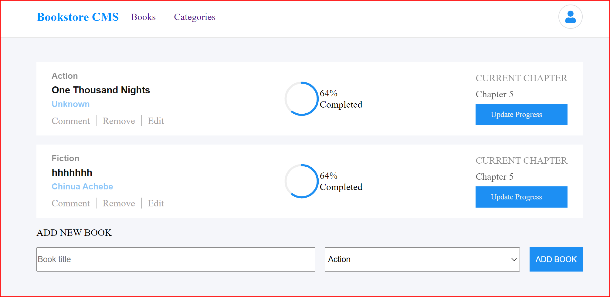

# Bookstore App
The Bookstore App is an app built with React. In this milestone, I configured the Redux Store and write actions and reducer for adding and removing books; connected the book application to an existing API to create and remove books in a remote server. I also styled the application. 



## Built With

- HTML, CSS, JavaScript, React, and Webpack;
- Visual Studio, Git & GitHub;

## Getting Started

### Running locally
To run this project, you only need a computer with a browser (like Google Chrome, Mozilla Firefox, Microsoft Edge, Apple Safari, etc.) installed, and follow these steps:

1. In your terminal, type the following, to clone this repository:

```sh
$ git clone https://github.com/Chike1990/bookstore.git
```

2. After, run the following commands in your terminal:

```sh
$ cd bookstore
$ npm install
$ npm run build
$ cd dist
```
<details align="right">
<summary><small>What are these commands?</summary>
- the `$ cd` command is used to move to different folders.<br>
- while `$ npm run build` is used to compile the aplication files.</small>
</details>

## Author

👤 Chibuike Uzoechina

- GitHub: [@Chike1990](https://github.com/Chike1990)
- Twitter: [@ChibuikeUzoechi](https://twitter.com/ChibuikeUzoechi)
- LinkedIn: [@Chibuike-Uzoechina](https://www.linkedin.com/in/chibuike-uzoechina-630857102)


## 🤝 Contributing

Contributions, issues, and feature requests are welcome!

Feel free to check the [issues page](https://github.com/Chike1990/Bookstore).

## Show your support

Give a ⭐️ if you like this project!

## 📝 License

This project is [MIT](./LICENSE) licensed.
